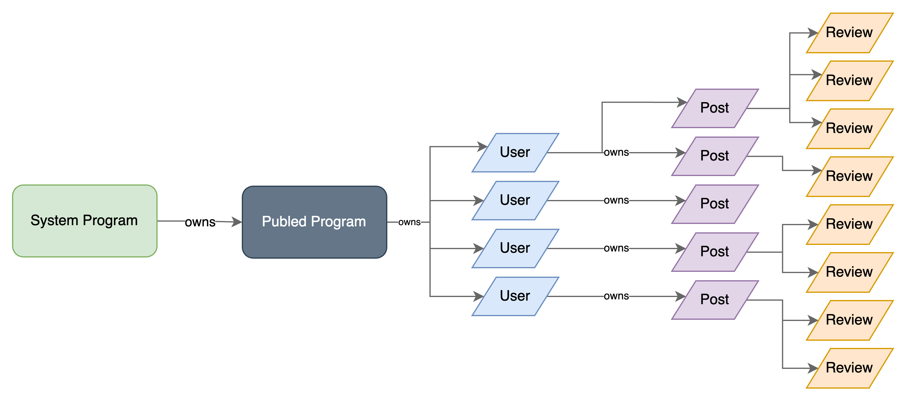

# Publed

## Decentralizing Scientific Publishing

Publed is a decentralized scientific publishing platform that aims to address the challenges of the traditional and centralized publishing system by empowering researchers, liberating them from traditional gatekeepers, granting ownership, and enabling the monetization of their genuine work through crypto-economic incentives.

### How to try it:

To try the application run:

```bash
npm run app:start
```

To try a different program:

```bash
npm run program:deploy
```

## **Intro**

### **Folder structure**

```
├── publed-programs
│   ├── migrations
│   ├── programs
│   │   ├── publed-progams
│   │   │   ├── src
│   ├── target
│   ├── tests
│   ├── js
│   ├── wallet.json
├── app
│   ├── src
│   │   ├── pages
│   │   ├── components
│   │   ├── context
│   │   ├── hooks
│   │   ├── api?
│   │   ├── App.tsx
│   │   ├── App.css
│   │   ├── idl.json
│   │   ├── index.tsx
└── .gitignore
```

### **Program Diagram**



## **Front End**

### Pages and Componentes


- Navbar / Header **[c]**
- Layout **[c]**
- Footer **[c]**
- Landing Page
  - “slogan” **[c]**
  - Vision **[c]**
  - Problems **[c]**
  - How it works **[c]**
  - … **[c]**
- About
- Sign-in
  - Connect Wallet / Wallet Multi Button **[c]**
- Sign-up
  - Connect Wallet / Wallet Multi Button **[c]**
  - Sign Up Form **[c]**
- Contact Us / Team
  - Team Card **[c]**
- Explore
  - Free Access Papers
  - Paid Access Papers
  - List **[c]**
  - ListItems **[c]**
  - Search Bar **[c]**
  - Filter **[c]**
- Subscription Plans
  - Subscription Cards **[c]**
- Reviewer Assignment
  - List of Reviewers **[c]**
- Review Process
  - Review Form **[c]**
- Author Dashboard
  - Author Card **[c]**
  - List of ROs **[c]**
- Reviewer Dashboard
  - Review Card **[c]**
  - List of Reviews **[c]**
- Upload
  - Upload Form **[c]**
- Research Object Tracker (check status of review…)


### Devnet Address
E2JpF1p5zAzVYxyEkHkD4tVNMYftueEQB782kBBZCB4Y